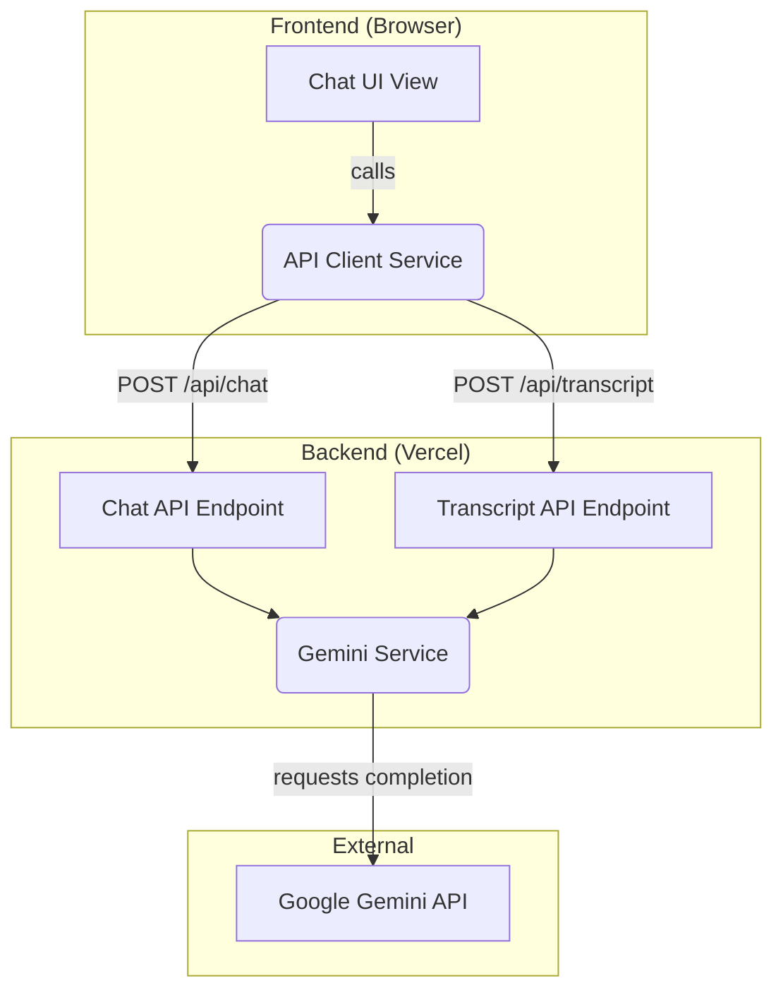

# Components

Frontend: Chat UI View, API Client Service

Backend: Chat API Endpoint, Transcript API Endpoint, Gemini Service

## Component Interaction Diagram

```mermaid
graph TD
    subgraph "Frontend (Browser)"
        A[Chat UI View] -->|calls| B(API Client Service);
    end

    subgraph "Backend (Vercel)"
        C[Chat API Endpoint] --> E(Gemini Service);
        D[Transcript API Endpoint] --> E;
    end
    
    subgraph "External"
        F[Google Gemini API]
    end

    B -->|POST /api/chat| C;
    B -->|POST /api/transcript| D;
    E -->|requests completion| F;
```